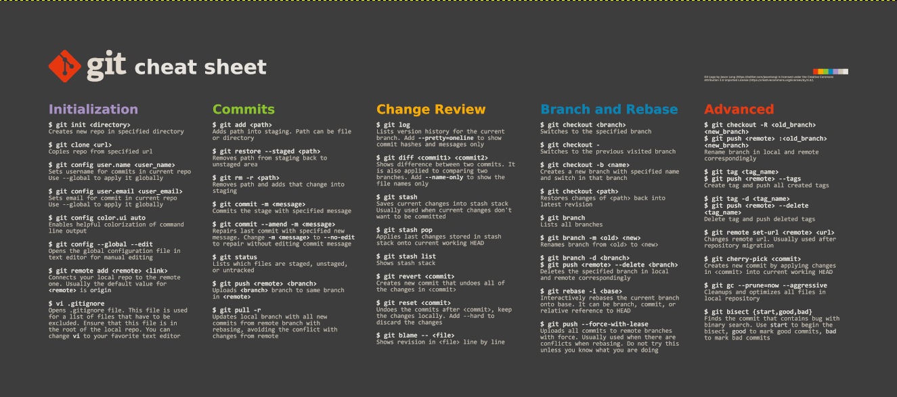

# <font color="pink"> Command-line Tools for Linguists Fall 2025</font>


This course teaches the basics of command-line tools, like moving through directories, editing files, sorting content of files and making scripts. 
It is tailored towards linguists, which means that it focuses on commands relevant for computational linguistics and language technology. 
It is taught at the university of Helsinki.

## <font color="pink"> Module 1: Introduction to Command Line Environments </font>
In this module linguists are introduced to Ubuntu. They are taught how to move through directories, display content of text files and edit those files.
A glimpse of the commands used in this week:

commands | what it does
---|---
`ls` | show a list of all (hidden) files in this directory
`pwd` | prints working directory 
`whoami` | prints current user
`wget` | can be used to download a file, for example: `wget https://www.gutenberg.org/files/215/215-0.txt` download a file from Project Gutenberg
`mv` | moves a file from one directory to another
`cat` | prints the text of a file 
`less` | shows the text of a file in a more readable format
`cp` | copies a file 
`rm` | removes a file (or directory)
`mkdir` | makes a directory
`cd` | changes directory
`head` | print the beginning of a file
`wc` | tells you the wordcount

For all these commands, there are optional parameters to use when you want it to behave just a little different. Try using `command --help` and see what the options are!

Personally, I have saved a cd to my windows directory with my masters folder and my most used folder in the unix system. I can mv and cp files from my Windowsstation to my Linux filestation in Ubuntu easily that way

Another topic touched upon in this week is *permissions*
You can check the permissions of a file using `ls -l` or add an additional path to a file at the end. You can change permissions using `chmod`. Knowing how permissions works is useful when you start running scripts from the command-line!

## <font color="pink"> Module 2: Text Processing in UNIX </font>

In module one we learned how to open a file (with nano, cat, or less) and in module 2 we learned how to process these texts.
This can be useful to make wordlists, for example.

Some useful combinations:

commands | what it does
---|---
`uniq -i` | Returns a list of all unique words, case insensitive
`sort -f` | Returns a list of all words in alphabetical order, ignoring capital letters
`tr -s "[:space:][:punct:]" "\n"` | Puts every word on a new line by removing punctuation and spaces, and squeezes double spaces with -s 

It is possible to combine these commands, like this:

> `cat myfile.txt | tr -s "[:space:][:punct:]" "\n" | sort -f | uniq -i` 

This gives you a wordlist! However, whenever making wordlists it is always important to look at the file you're working on, as it is never a one size fits all solution

Another combination of commands is this:

> `cat myfile.txt | tr -s "\n\r\t "  "\n" | tr -dc "[:alnum:]\n'" | sort | uniq -c | sort -nr  > myfile.freq`

This gives you a sorted word frequency list. This combination and the combination above all have in common that they first do some kind of modification to get rid of unwanted characters, like punctuation, white spaces and new lines. The following two transformations both get rid of newlines, but with different methods:


> `| tr -dc "A-Za-z0-9\n'" ` and `tr -dc "[:alnum:]\n'"`

There is also `sed`, which can be used to find and change patterns in a text.


Sometimes it is necessary to check the filetype of a file before and to convert it before you can process it.

You can check a file's encoding with `file <filename>`.
Here are to ways to change a file's encoding:

`iconv -f ISO-8859-1 -t UTF-8 myfile.txt > myfile.utf-8.txt`


`dos2unix myfile.utf-8.txt`

Since I study language technology, all of this will be very useful for any preprocessing I will need to do on data in the future. Also it is also fun to know for personal projects.

## <font color="pink"> Module 3: Scripting, Configuration Files and Installing Programs </font>

When you need to process a lot of text files, it is easier to combine the commands into *scripts*. That is what this module is all about.

A script can look as simple as this:

```bash
# !/bin/bash

# This script prints the word script

echo script
```


But what makes them powerful is that you can use variables and give them conditional clauses, like here:

```bash
# !/bin/bash

# This program makes the comparative form
# of an English adjective ending in a consonant

while read -r line;

do
       if [ "${line: -1}" = "y" ]; then
               echo $line | sed "s/y$/ier/"
       else
               echo "${line}er"
       fi

done < "$1"
```

This functions used the first argument ($1) and uses it throughout the function. 

Another powerful tool learned during this module is installing software and packages.
Using `sudo`, which gives you the power of the rootuser to install software. This can look like:

>`sudo apt install python3`

Which installs Python 3 for you.
When you continue to work with Python, you will come across Python packages. These can be installed with `pip`, such as:

>`pip install pandas`

This command installs the pandas library for you.


Most of this was familiar to me. It had been a while since I had last made a Bash script so getting used to the syntax again took some effort. It is nice to know it again. I've used quite some Python in the past so installing libraries was not new to me!
## <font color="pink"> Module 4: Using ssh, scp and Version Control </font>

This module focused on processes, remote servers and version control.

A process is is something that is currently executed on your computer. You can check all your current processes using `ps`. If you ever want to stop an unwanted proces, you can use `kill` with the process id.

Sometimes you need to perform a task which is too heavy on your own computer. In that case, it is recommended to connect to a remote server and perform the task on a supercomputer. Puhti is one of those computers. 

Version control was introduced using github. It teaches you how to clone a rep, push, pull, revert changes and other important tools when working on a project.
There exist numerous cheatsheets for this online, here is just one of them:



I used git at my previous workplace so this was something I was familiar with already. Connecting to a remote server however was new, and I expect to need it during my studies! That was useful to learn.

## <font color="pink"> Module 5: Building Webpages using GitHub Pages </font>

You are currently looking at the result of module 5. This module teaches you how to build webpages using Markdown and Jekyll. I am now capable of setting up a GitHub page, starting a local server using Jekyll and pushing my work to GitHub.

We use Ruby to set up Jekyll. Using `bundle exec jekyll serve` we set up a local server where I can view my GitHub page. Pretty cool right?

In addition to all this, I also made my CV on Overleaf. It can be viewed on the Homepage. 

I have never worked on a GitHub page this extensively before and hadn't really used Markdown before. It's nice to see the project progress and to create a final product. 

All in all, you familiarize yourself with a lot things during this course.

* Moving through directories
* Creating directories and files
* Processing these files and transforming them!
* How to put commands in a script
* How to check for permissions and how to change them
* How to use GIT
* How to connect to remote servers
* How to build a page using Markdown
* And, finally, how to problem solve when nothing goes well on your first try


